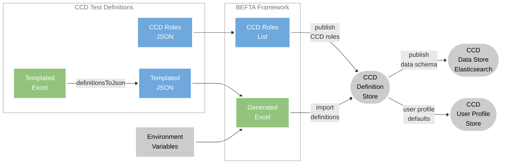

# CCD Test Definition Files


## Purpose

This library holds the test case definition files used when running automated testing against a number of the CCD 
backend microservices.  This library is designed to be used with the [BEFTA Framework](https://github.com/hmcts/befta-fw),
which can dynamically generate an environment specific version of these definition files and import them to a 
[CCD Definition Store](https://github.com/hmcts/ccd-definition-store-api) instance.


## Getting Started

For information on prerequisites and how to configure a project to use these test definition files see
[BEFTA Framework](https://github.com/hmcts/befta-fw).


## Definition files

This library contains definition files in both Excel and JSON formats.

Typically, CCD services under test will call [BEFTA Framework](https://github.com/hmcts/befta-fw) code in order to load
and import this definition data before running the functional tests.

#### BEFTA's definition file generate and import process


*([mermaid live edit](https://mermaid.live/edit#pako:eNqdVN9r2zAQ_leE87KBDWEry-aUwNqkg9L9IMn2kuRBls6NVlsykpy2NP3fJ8mKbTkMxt6ku_u-u_vupJeICApRGt1LXO3R3XLLEQJ-SA5Ybhb8wKTgJXB9mcnZLywZzgpQu6mNopAnSgsJbzbX1_PLq-VsDjnjTDPB7W1lfbu3LhYKrDQjCrAk-y4ea4xcmL0t-jEeVyuQSSVFzgoYJPtpXOhH4xqmI4QmUphKk99K8CSZdYaCKe1ivAeeCBTJPXCQWAOd9vr_izfkMkHHqs7McW-rMMUh5zy28jSUIZFFsbISUlsQbXUbwtrbIA21yimyhxIfA23PUVZCVHU6GSeuC62O59o6sKqzZhc0mO56pVnh0doYUTdntbOQoeAucmmvNuHt6vu3ZmO8DJs1lFVhZXBjt6aT36ED9xna9tSrai1uDeZogX52NOgig1zjJH_cXC1u1p_RjcQlPAr5cFa4HWZY-J2xhKnb-W2-nE6DFnx6YmaijEzINMI4MhIX6YgQEistxQOkozzP_Tl5ZFTv04vqKSaiEDIdjcfjaUDiknuST-_JxYT-E4_xhTxWJE_zIccfKfk_moJlEstnz9RB-x16mncdzWQy6Wi6FY3P1zAONjr2r7GRskfhVIkHg2msvSjbcxyuZxwOHbW70yCGex_nNSf2hIvE-uLTSp2EmEZxVIIsMaPmI32xTNtIm7cJ2yg1R__ittGWv5pQXGuxeuYkSrWsIY7qyrxmmDNsFraM0hwXqrUuKDOKnCLB3b42H7b7t1__ADczCKw))*

The [BEFTA Framework](https://github.com/hmcts/befta-fw) will by default load the JSON definitions from the resource
directory [`uk/gov/hmcts/ccd/test_definitions/valid`](./src/main/resources/uk/gov/hmcts/ccd/test_definitions/valid/.), 
and will combine them with [Environment variables](#environment-variables) and flags to create the environment specific 
Excel files and import them to the [CCD Definition Store](https://github.com/hmcts/ccd-definition-store-api).  

### CCD Roles

This library contains a JSON file listing the CCD roles needed during the import of the test definition files. The
`DataLoaderToDefinitionStore` class supplied by the [BEFTA Framework](https://github.com/hmcts/befta-fw) will load CCD
roles from a file named [ccd-roles.json](./src/main/resources/uk/gov/hmcts/ccd/test_definitions/ccd-roles.json) and will
publish them to the [CCD Definition Store](https://github.com/hmcts/ccd-definition-store-api) prior to importing the
generated definition files, see [Importing CCD roles](https://github.com/hmcts/befta-fw/#3111-importing-ccd-roles).

### Environment variables

The following environment variables are used during the BEFTA import process to dynamically populate the templated 
callback URLs in the definition files:

| Name                       |                           Default (if not set)                            | Description                                                                                                                                                                                                                                                                                                                                  |
|----------------------------|:-------------------------------------------------------------------------:|----------------------------------------------------------------------------------------------------------------------------------------------------------------------------------------------------------------------------------------------------------------------------------------------------------------------------------------------|
| TEST_STUB_SERVICE_BASE_URL |   `http://ccd-test-stubs-service-aat.service.core-compute-aat.internal`   | Path to [hmcts/ccd-test-stubs-service](https://github.com/hmcts/ccd-test-stubs-service) instance. <hr/> When running BEFTA import against a local [CCD-Docker](https://github.com/hmcts/ccd-docker) use `http://host.docker.internal:5555`.                                                                                                  |
| MCA_API_BASE_URL           | `http://aac-manage-case-assignment-aat.service.core-compute-aat.internal` | Path to [hmcts/aac-manage-case-assignment](https://github.com/hmcts/aac-manage-case-assignment) instance. <hr/> When running BEFTA import against a local [CCD-Docker](https://github.com/hmcts/ccd-docker)/[ACA-Docker](https://github.com/hmcts/aac-manage-case-assignment/tree/master/aca-docker) use `http://host.docker.internal:4454`. |

> Note: The [BEFTA Framework](https://github.com/hmcts/befta-fw) may also attempt to rewrite some URLs to their 
> environment specific namespaces, e.g. converting AAT URL -> Demo URL.
  
### Making changes to definitions

> Note:
> Json files or Excel files can be modified.
> Whichever method is used to modify please ensure that
> json files and the relevant Excel files reflect all modifications

:warning: Any changes made to Excel files in the directory 
[`src/main/resources/uk/gov/hmcts/ccd/test_definitions/excel`](./src/main/resources/uk/gov/hmcts/ccd/test_definitions/excel/.)
will *NOT* be imported to the definition store.

The Excel files may be updated, rather than the JSON directly, but for these changes to take effect, they must be 
applied to the corresponding JSON files, by executing the `DefinitionConverter` class provided by
[BEFTA Framework](https://github.com/hmcts/befta-fw).  This can be done by either:

* **Running `DefinitionConverter` against all Excel files**

  The `definitionsToJson` gradle task will run the `DefinitionConverter` against each of the Excel files in the directory
  [`src/main/resources/uk/gov/hmcts/ccd/test_definitions/excel`](./src/main/resources/uk/gov/hmcts/ccd/test_definitions/excel/.).
  This will replace the corresponding output in the following directory:
  [`src/main/resources/uk/gov/hmcts/ccd/test_definitions/valid`](./src/main/resources/uk/gov/hmcts/ccd/test_definitions/valid/.).

  ```bash
    ./gradlew definitionsToJson
  ```

OR

* **Running `DefinitionConverter` against a single file**

  This can be done by creating a run configuration within your IDE, providing the path to the main class 
  `uk.gov.hmcts.befta.dse.ccd.DefinitionConverter`, as well as the necessary program arguments listed below.

  ```
    arg1: to-json | to-excel : key word to convert from excel to json or from json to excel
    arg2: input file path for excel document or parent jurisdiction folder for json version
    arg3: (Optional) output folder path for resulting json or excel file. By default will use parent folder from the input location
    arg4: (Optional) Boolean: true - use jurisdiction name to generate the parent folder name when converting from excel to JSON,
          false - use file name as the folder name
  ```

### Priming a new local [CCD-Docker](https://github.com/hmcts/ccd-docker) environment

The quickest way to populate a new/empty [CCD-Docker](https://github.com/hmcts/ccd-docker) environment with the test
definition files is to run either the `smoke` or `functional` tests on either a local clone of
[CCD Definition Store](https://github.com/hmcts/ccd-definition-store-api) or
[CCD Data Store](https://github.com/hmcts/ccd-data-store-api):

* **Running smoke tests**
  ```bash
  ./gradlew smoke
  ```

OR

* **Running functional tests**
  ```bash
  ./gradlew functional
  ```


### Generating definition files without templated URLs

The Excel files in this library **should not be** imported directly into an environment as they contain callback URLs
that are in a templated format: `${ENV_VAR:http://default.value}/rest_of_url_path`.  Without these URLs being correctly
processed by the [BEFTA Framework](https://github.com/hmcts/befta-fw) into valid values will result in any attempt to
trigger the related case events to fail.  

> **Note: Importing these raw Excel files into a higher-level environment may
cause in-flight pipelines running against that environment to fail.**

Therefor, to generate a set of definition files without the templated URLs: ensure the
[environment variables](#environment-variables) are set and then use the following command:

```bash
./gradlew definitionsToExcel
```

The generated Excel files will be outputted to the following directory:
[`src/main/resources/uk/gov/hmcts/ccd/test_definitions/excel_generated`](./src/main/resources/uk/gov/hmcts/ccd/test_definitions/excel_generated/.).

> Note: To import one of these generated definition files into a local [CCD-Docker](https://github.com/hmcts/ccd-docker)
> environment, see [import case definition](https://github.com/hmcts/ccd-docker/#5-import-case-definition).


## Testing 

### Testing locally

To test changes to these definition files locally before creating a pre-release version: 

**Changes in this project**:

1. Update [Excel files](./src/main/resources/uk/gov/hmcts/ccd/test_definitions/excel/.).
2. Re-generate the [JSON files](./src/main/resources/uk/gov/hmcts/ccd/test_definitions/valid/.), execute:
   ```bash
   ./gradlew definitionsToJson
   ```
3. Update the build number in the [build.gradle](./build.gradle) file to a unique *pre-release* build number in the
format: `<next-release-number>_<ticket-number>`: e.g. `7.22.2_CCD-3853`.
5. Publish library to local repository, execute:
   ```bash
   ./gradlew publishToMavenLocal
   ```

**Testing in [CCD Definition Store](https://github.com/hmcts/ccd-definition-store-api) and / or
[CCD Data Store](https://github.com/hmcts/ccd-data-store-api) project**:

5. Update the `ccd-test-definitions` version number in the project's `build.gradle` file:
   ```groovy
   testCompile group: 'com.github.hmcts', name: 'ccd-test-definitions', version: '7.22.2_CCD-3853'
   ```
6. Run functional tests, execute:
   ```bash
   ./gradlew functional
   ``` 


### Pipeline testing in isolation

The case definition import process includes data being published to each of the following services, see 
[definition file generate & import process](#beftas-definition-file-generate-and-import-process) for diagram of process
flow: 
* [CCD Definition Store](https://github.com/hmcts/ccd-definition-store-api),
* [CCD Data Store](https://github.com/hmcts/ccd-data-store-api)'s elasticsearch instance,
* [CCD User Profile Service](https://github.com/hmcts/ccd-user-profile-api).

For the preview pipelines, by default, this will involve data being published to shared instances of these services.
Therefor, to prevent unapproved case definition changes impacting other pipelines it is important that these changes are
tested in isolation.

#### Configuring pipeline isolation

To run in isolation requires the generation of test pull requests (PRs) in each of the services: which have:
* `keep-helm` label set to ensure instance remains active after the pipeline is complete.
* Preview chart configuration updated so each service correctly references the other PR instances.
* Jenkins' configuration updated so any BEFTA steps can correctly reference the other PR instances.

The pipeline configuration is explained in further detail below for each service:

> Note: the test pipelines/PRs should be generated and running in isolation in advance of their configuration to use the
> CCD Test Definition pre-release version that is under test.

**[CCD Definition Store](https://github.com/hmcts/ccd-definition-store-api) pipeline configuration**:

* `charts/ccd-definition-store-api/values.preview.template.yaml` override the following:
  * `ELASTIC_SEARCH_HOST` with [CCD Data Store](https://github.com/hmcts/ccd-data-store-api) PR number.
  * `USER_PROFILE_HOST` with [CCD User Profile Service](https://github.com/hmcts/ccd-user-profile-api) PR number.
    *(optional) Only required if User Profile Service is included in isolation.*

**[CCD Data Store](https://github.com/hmcts/ccd-data-store-api) pipeline configuration**:

* `charts/ccd-data-store-api/values.preview.template.yaml` override the following:
  * `DEFINITION_STORE_HOST` with [CCD Definition Store](https://github.com/hmcts/ccd-definition-store-api) PR number.
  * `USER_PROFILE_HOST` with [CCD User Profile Service](https://github.com/hmcts/ccd-user-profile-api) PR number.
    *(optional) Only required if User Profile Service is included in isolation.*
* `Jenkinsfile_CNP` override the following:
  * `definitionStoreDevelopPr` with [CCD Definition Store](https://github.com/hmcts/ccd-definition-store-api) PR number.
  * `env.ELASTIC_SEARCH_FTA_ENABLED` to `"true"`.  i.e. so functional tests include all Elasticsearch elements.

**[CCD User Profile Service](https://github.com/hmcts/ccd-user-profile-api) pipeline configuration**:
*(optional) Only required if testing changes for a new jurisdiction or if changing the user profile defaults in the
`UserProfile` tab; as these will be published to the
[CCD User Profile Service](https://github.com/hmcts/ccd-user-profile-api).*
* `Jenkinsfile_CNP` override the following:
  * `definitionStoreDevelopPr` with [CCD Definition Store](https://github.com/hmcts/ccd-definition-store-api) PR number.

Only once all of the above are up and running can they then have their `ccd-test-definitions` version number in the
project's `build.gradle` file updated to point to the pre-release version that is under test:
```groovy
testCompile group: 'com.github.hmcts', name: 'ccd-test-definitions', version: '7.22.2_CCD-3853'
```

## License

This project is licensed under the MIT License - see the [LICENSE](LICENSE) file for details.